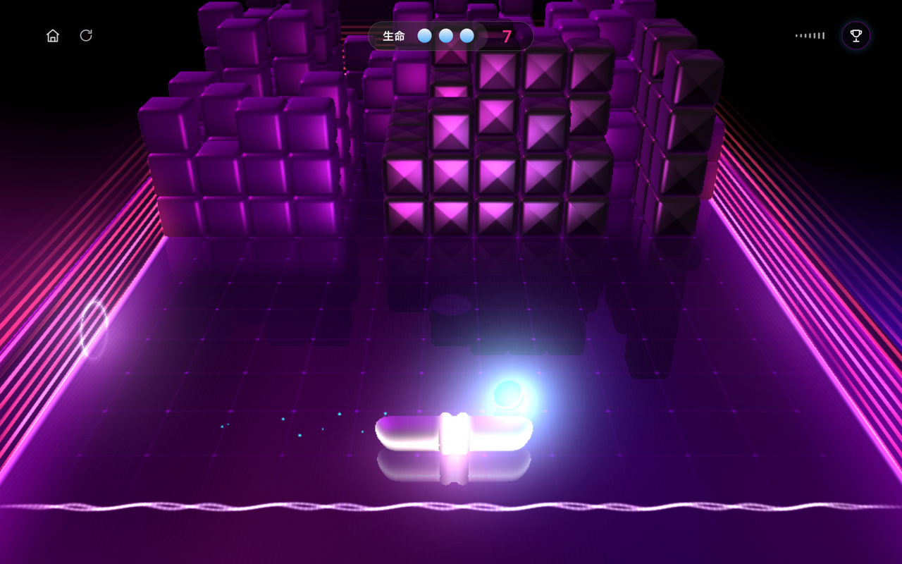
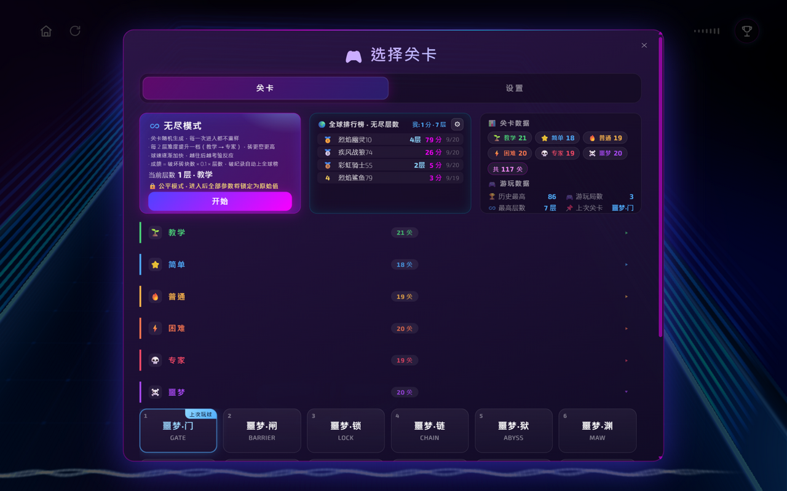

# 3D-Breakout

经典街机《打砖块》的 3D 重制版 —— 纯前端 WebGL 游戏，可直接在浏览器里玩，也可打包成飞牛 NAS（fnOS）应用安装。





## 特性

- **真 3D 渲染**：WebGL + 物理引擎驱动的碰撞与下落，方块逐层消解有真实的堆叠感
- **117 个关卡**：教学 / 简单 / 普通 / 困难 / 专家 / **噩梦** 六档难度，按难度分组折叠展示
  - 内置关卡设计器思路：网格数据 11×13×4，支持多层堆叠与不可破坏墙阵
  - 全部关卡通过可通关性校验（不会出现"墙堵死、砖永远打不到"的死局）
- **无尽模式 + 全球排行榜**：随机关卡渐次加压，成绩按"破坏砖块数 × 0.1 × 层数"计算，破个人纪录才上传
- **可调参数**：出现频率 / 效果时长 / 生命数 / 分数倍率 / 小球速度（最高 5×）、每种道具的开关与掉落权重
- **本地游玩数据**：历史最高、游玩局数、最高层数、上次关卡，全部存浏览器本地
- **多端适配**：桌面 / 手机竖屏布局自适应；飞牛桌面小窗会引导切到完整标签页以获得更好帧率
- **飞牛 NAS 打包**：一条命令产出 `.fpk`，在应用中心手动安装即用

## 直接玩

- 在线试玩：<https://690075.xyz/game/>
- 本地运行：

  ```bash
  scripts/dev.sh            # 默认 http://127.0.0.1:5173/
  PORT=8080 scripts/dev.sh  # 自定义端口
  ```

  纯静态站点，任何 HTTP 服务器指向 `web/` 目录均可。

## 打包成飞牛应用（.fpk）

```bash
scripts/package.sh                 # 使用 fpk/manifest.template 中的版本号
VERSION=1.3.0 scripts/package.sh   # 覆盖版本号
```

产物输出到 `dist/breakout3d-<version>.fpk`，安装方式：飞牛桌面 → 应用中心 → 右上角手动安装 → 选择该文件。

打包脚本优先调用官方 `fnpack`（放在 `tools/bin/` 即启用），找不到时回退到纯 `tar` 方案，产物结构一致。

网页版部署（抽取引用链、剔除历史版本文件，15 MB → 3.3 MB）：

```bash
scripts/build-web.sh                 # 产出 dist/web/
scripts/build-web.sh --deploy-local  # 另同步到指定静态站目录
```

## 目录结构

```
.
├── web/                    # 前端静态资源（游戏本体）
│   ├── index.html          # 入口：游戏 + 选关/设置面板 + 排行榜 UI
│   ├── launcher.html       # 小窗环境下的启动引导页
│   └── assets/             # 引擎 bundle、关卡数据、音频、字体
├── fpk/                    # 飞牛应用包模板
│   ├── manifest.template   # 应用元信息（{{CHECKSUM}} 由打包脚本填充）
│   ├── cmd/                # 生命周期钩子（install/start/stop/...）
│   ├── config/             # 运行身份与资源声明
│   └── app/ui/index.cgi    # CGI 静态文件服务（把 www/ 暴露给桌面窗口）
├── scripts/
│   ├── dev.sh              # 本地开发服务器
│   ├── package.sh          # 构建 .fpk
│   ├── build-web.sh        # 构建网页版部署目录
│   └── collect_refs.py     # 资源引用链收集（构建用）
├── tools/                  # 关卡生成与校验工具（Python）
│   ├── random_levels.py         # 按难度随机生成关卡
│   ├── gen_theme_levels.py      # 主题关卡（多层结构）
│   ├── gen_nightmare_levels.py  # 噩梦难度关卡
│   └── verify_nightmare.py      # 可通关性求解器（模拟消解直到不动点）
├── docs/
│   ├── fnos-package.md         # 飞牛 .fpk 包结构详解
│   ├── screenshot-gameplay.png # 游戏画面截图
│   └── screenshot-levels.png   # 选关面板截图
└── dist/                   # 构建产物（gitignore）
```

## 关卡数据格式

自定义关卡写入 `web/assets/leveldesign.*.dat`，每关 581 字节：

| 偏移 | 内容 |
|------|------|
| 0 | 难度 0-5（教学…噩梦） |
| 1-8 | 关卡名（ASCII，0 结尾） |
| 9-580 | 方块数据 572 字节 = 11 列 × 13 行 × 4 层 |

方块值：`0` 空、`1` 不可破坏墙、`2/3/4` 可破坏砖（三档亮度）、`5` 奖励砖。

设计硬约束（校验器会拦）：球沿固定行线行进且方块只能**同柱竖直下落**，因此

- 每块砖的同柱下方不能有墙（墙不破，砖永远打不到）；
- 不可破坏墙柱只能出现在行线的"最深处"，其后不能再有砖柱。

`tools/verify_nightmare.py` 可对任意关卡做完整消解模拟，输出剩余不可达砖数。

## 玩法说明

- 挡板跟随鼠标 / 手指移动，接住球并改变反弹角度
- 打碎全部可破坏砖即通关；生命耗尽或无尽模式球落地则该局结束
- 无尽模式：每 2 层难度升一档，球速渐增，成绩自动上榜（公平模式锁定参数）
- 设置页可调全部参数与道具掉落；数据实时生效并存本地

## 隐私

唯一联网功能是无尽模式的全球排行榜，上传内容仅为：昵称（首次自动生成，可修改）、到达层数、破坏砖块数、提交时间。不收集任何身份信息；普通关卡的游玩数据与全部设置只保存在浏览器本地。详见游戏内隐私条款。

## 致谢

原版《打砖块》3D 游戏由 [Merci-Michel](https://gang.tv/works/msi-i-want-it-all) 为 MSI 开发。本项目在其基础上做了移动端适配、关卡扩充、排行榜与本地化改造，仅供学习与个人使用。

## 许可证

代码仅供学习交流使用。原版游戏素材版权归原作者所有。
